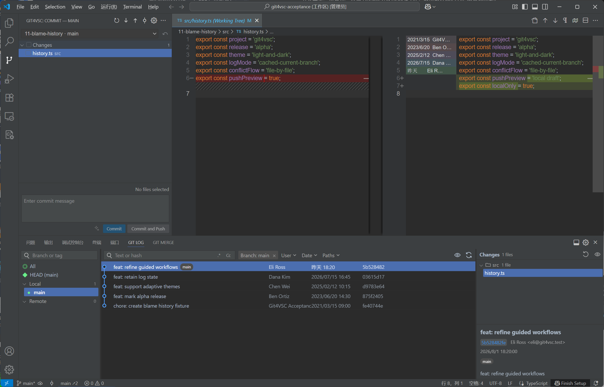
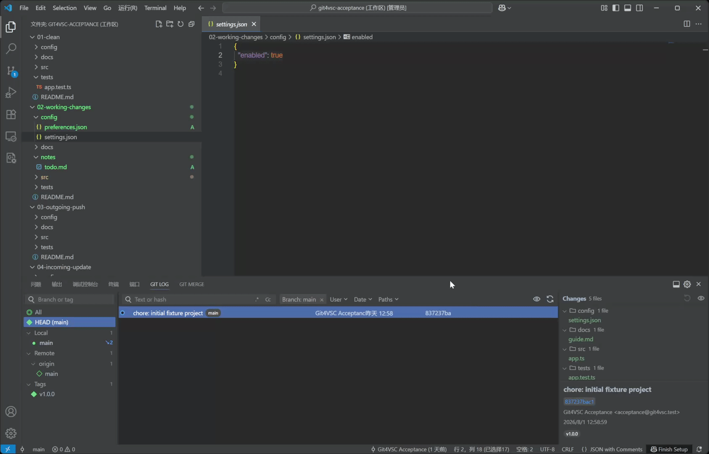
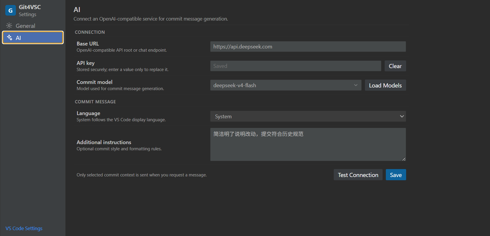

# Git4VSC

Git4VSC 是一个面向 Visual Studio Code 的本地 Git 工作流扩展。它将提交、分支、Commit Log、Push 预览和逐文件冲突处理集中到稳定的工具窗口中，同时继续使用 VS Code 原生编辑器、Diff 和 Merge Editor。

项目调用本机 Git CLI；仓库状态、提交图和主要界面由 TypeScript 与 React 实现。产品结构和交互参考了 JetBrains Git4Idea 与 IntelliJ Platform VCS Log 的公开行为，但不复制其代码、图标或专有素材。

> 当前版本：`0.1.0 Preview`。单仓库的日常提交、同步、历史浏览和冲突处理流程已经可用。

## 功能预览

### Commit Log、Diff 与 Git Blame



### 从 Annotate with Git Blame 到 Commit



### AI Commit Message 设置



## 核心功能

### Commit 与 Push

- 在左侧 Commit 工具窗口中按文件选择本次提交内容，并可直接检查 Diff、回滚或提交。
- 双击文件查看 Diff；右键执行 Commit File、Rollback、Delete、Jump to Source、Add to VCS 或 Add to Ignore。
- 提交信息区域可拖动调整高度，支持 **Commit** 和 **Commit and Push**。
- Push 前预览待推送提交和文件；文件可按目录分组、展开并打开 Diff。
- 支持修改远程目标分支，以及普通 Push 和基于 `--force-with-lease` 的 Force Push；受保护分支会禁用 Force Push。
- 非快进 Push 被拒绝时，可选择 Merge 或 Rebase 更新，成功后自动重试一次 Push。

### Commit Log 与历史操作

- 拓扑提交图、虚拟滚动和分页加载，支持普通分叉、Merge 与多父提交。
- 默认聚焦当前分支，保留上次选择、筛选条件和视图状态，避免重复打开时重新跳动。
- Text or hash 支持普通文本、Hash、正则、大小写匹配和最近搜索。
- 支持 Branch、User、Date、Paths 组合筛选；Paths 使用扩展内的目录/文件选择窗口。
- Author、Date、Hash 列可独立显示或隐藏，列宽可调整；时间支持相对格式。
- 提交详情支持目录分组或平铺，并可隐藏详情区。
- Commit 级操作包括创建分支/Tag、Checkout、Cherry-Pick、Revert 和 Reset。
- 文件级操作包括 Diff、本地比较、打开仓库版本、选择性 Revert/Cherry-Pick、创建 Patch、Get from Revision 和按路径筛选历史。

### 分支、远程与仓库状态

- 管理本地/远程分支、收藏分支、Tracking、Tag 和 Remote。
- 支持 Checkout、Checkout and Update、Checkout and Rebase、Merge、Rebase、Pull、Push 和创建 Worktree。
- 本地修改阻塞 Update/Checkout 时提供 Smart Operation：临时 Stash、完成操作并恢复修改；恢复冲突继续进入逐文件解决流程。
- 支持创建和管理 Git Stash，包括 Apply、Pop、恢复暂存状态、Drop、查看文件和从 Stash 创建分支。
- Commit 标题、分支列表与状态栏显示 ahead/behind 数量；有更新或待推送提交时使用方向和颜色提示。
- 状态栏的分支区域打开仓库与分支操作菜单，旁边的 Commit Log 图标单独切换日志。
- 长时间操作在不改变文件列表布局的位置显示进度，完成后给出简短结果通知。

### 冲突解决

- Merge、Rebase、Cherry-Pick 或 Revert 发生冲突后，显示持续存在的逐文件冲突列表。
- 每个文件以 **Current｜Result｜Incoming** 三列打开 VS Code Merge Editor，也可直接接受 Current 或 Incoming。
- 支持 Mark Resolved and Open Next、重新解决文件，以及 Continue/Abort 当前 Git 操作。

### Git Blame

- 在编辑器行号区域右键选择 **Annotate with Git Blame**，再次执行即可关闭。
- 在行号右侧紧凑显示提交日期和作者，未提交的新行保持空白。
- 不同时间的提交使用不同背景色；悬浮可查看作者、邮箱、摘要、Hash 和完整时间。

### AI Commit Message

- 可连接用户自己的 OpenAI-compatible API，加载或填写模型。
- 根据本次勾选文件的实际变更上下文生成提交信息，并支持再次点击停止生成。
- 可以配置输出语言和额外指令；未配置时点击灰色 AI 图标会直接打开 AI 设置。
- API Key 保存在 VS Code SecretStorage 中。只有主动生成时才会发送选中变更上下文，不会自动上传整个仓库。

## 当前范围

| 工作流 | 状态 | 当前范围 |
| --- | --- | --- |
| Commit / Commit and Push | 可用 | 支持按文件提交；部分提交入口计划放入 Diff 交互 |
| Push Preview | 可用 | 提交和文件预览、目录分组、目标分支编辑、受保护分支和 Force Push 确认 |
| Update / Pull / Push | 可用 | Merge/Rebase、Smart Update 和 Push Rejected 恢复重试 |
| 分支、Tag 与 Remote | 可用 | 常用创建、切换、比较、合并、Rebase、Tracking 和删除操作 |
| Worktree | 部分可用 | 支持创建；暂不提供列表、打开、删除和 Prune 管理页 |
| Commit Log | 可用 | 图谱、组合筛选、可选列、详情和常用提交/文件操作 |
| 文件历史 | 部分可用 | 支持按路径筛选；暂不提供独立 File History 与 rename follow |
| Merge 冲突 | 可用 | 逐文件处理并使用 VS Code Merge Editor |
| Git Blame | 可用 | 时间着色和 Hover 详情；暂不支持点击跳转 Commit Log |
| AI Commit Message | 可选 | 使用用户配置的 OpenAI-compatible 服务 |
| Git Stash | 可用 | 创建、Apply/Pop、Reinstate Index、Drop、查看文件、从 Stash 建分支 |
| 部分提交 / Changelist | 规划中 | hunk patch 基础能力已具备，Commit 文件树暂不暴露独立入口 |
| Interactive Rebase | 未实现 | 后续版本评估 |

## 快速开始

### 提交本地变更

1. 打开 Git 仓库，在 Activity Bar 选择 **Git4VSC**。
2. 在 Commit 工具窗口勾选需要提交的文件。
3. 输入 Commit Message，或使用 AI 生成。
4. 点击 **Commit**，或点击 **Commit and Push** 后检查 Push 预览再推送。

### 查看提交历史

- 按 `Alt+3`，或点击工具窗口/状态栏中的 Commit Log 图标，打开或关闭底部日志。
- 使用 Text or hash 搜索，并组合 Branch、User、Date、Paths 筛选。
- 选择提交后，在右侧查看文件和详情；右键提交或文件执行历史操作。

### 更新和分支操作

- 使用 Commit 工具窗口顶部的向下箭头更新当前分支，向上箭头打开 Push 预览。
- 点击状态栏分支名打开仓库与分支菜单；Commit Log 图标只负责切换日志。
- Update 可以每次选择 Merge/Rebase，也可以在设置页保存默认策略。
- 本地修改阻塞 Update/Checkout 时可选择 Smart Operation；Stash Changes 和 Stashes 位于分支操作菜单与命令面板。

### 处理冲突

冲突发生后，从 Merge Conflicts 列表逐个打开文件。完成当前文件后选择 **Mark Resolved and Open Next**，所有文件解决后执行 **Continue**；需要放弃操作时执行 **Abort**。

## 设置

打开 **Git4VSC Settings**：

- **General**：更新策略、Smart Operation、Push Rejected、受保护分支、Force Push 确认、进度与结果通知。
- **AI**：Base URL、API Key、模型、输出语言和附加指令；支持加载模型和测试连接。

## 运行要求

- Visual Studio Code `1.102.0` 或更高版本
- Git `2.23` 或更高版本
- 扩展主机可以访问当前 Git 工作区；支持本地与 Remote Workspace

## 开发

要求 Node.js 20+、pnpm 11+ 和 Git 2.23+。

```bash
pnpm install
pnpm check
pnpm test:extension
pnpm package:vscode
```

工作区结构：

```text
packages/
  shared-types/   共享领域类型
  git-core/       Git CLI、状态、日志与补丁操作
  git-graph/      提交图布局和几何计算
  repo-state/     仓库状态、刷新与操作队列
  ui/             共享 React UI

apps/
  vscode-extension/
```

## 文档

- [总体架构](docs/architecture.md)
- [JetBrains Git/VCS Log 源码调研](docs/research/jetbrains-git-architecture.md)
- [VS Code 平台能力](docs/research/vscode-extension-capabilities.md)
- [早期功能对照调研（历史资料，以本页当前范围为准）](docs/research/feature-parity-matrix.md)
- [AI Commit 上下文调研](docs/research/ai-commit-context.md)
- [第三方声明](THIRD_PARTY_NOTICES.md)

## Marketplace 首发准备

- [x] 中英文 Marketplace 说明、分类、关键词与 Preview 元数据
- [x] Marketplace PNG 图标
- [x] 类型检查、单元测试、真实 Git 仓库集成测试和 Extension Host 测试
- [x] 添加产品截图和核心流程短 GIF
- [ ] 确定并添加项目许可证
- [ ] 确认 Marketplace Publisher 与发布凭据

## 声明

Git4VSC 是独立项目，与 JetBrains s.r.o. 或 Microsoft Corporation 不存在隶属或背书关系。JetBrains、IntelliJ、Git4Idea、Visual Studio Code 等名称归各自权利人所有。
