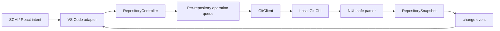

# Git4VSC Architecture

## 目标与约束

- 本机 Git CLI 是唯一 Git 执行后端；不启 shell，不硬编码 Git/terminal/IDE 路径。
- UI 不组装 Git 参数；VS Code adapter 只发送领域 intent。
- repository 是状态、锁、loading、error、cache 和未来 AI 状态的隔离单元。
- 写操作在单 repository 内串行，不同 repository 之间并发。
- 事件只标记 invalidation，刷新命令重新建立可信快照。
- 复杂 UI 共享 React，基础 VS Code 体验使用 SCM/TreeView/Command Palette/menus。

## Monorepo

```text
packages/
  shared-types/  GitChange, RepositoryStatus, CommitSummary, snapshot contracts
  git-core/      safe process runner, status/refs/log parsers, GitClient
  git-graph/     permanent lane layout and row geometry
  repo-state/    repository manager, invalidation refresh, per-repo operation queue
  ui/            React virtual Commit Log and graph renderer
apps/
  vscode-extension/  SCM, TreeView, virtual content/Diff, Webview host
```

依赖只向下：apps → ui/repo-state → git-core/git-graph → shared-types。`git-core` 不依赖 React 或 VS Code。

## 运行链路



### 打开与刷新

1. `RepositoryManager.open(path)` 用 `rev-parse --show-toplevel/--absolute-git-dir` 规范化 root 和 worktree gitdir。
2. 同一 canonical root 只创建一个 `RepositoryController`。
3. 初次 invalid set 为 `status/log/refs`；controller 并发读取 status 和 log。
4. snapshot 原子替换并发 change event。adapter 将它投影到宿主 UI。
5. watcher、命令完成、手动 refresh 只调用 `invalidate(parts)`；同一时刻只有一个 refresh loop，刷新期间新增 invalidation 会进入下一轮。

### 写操作

`stage/unstage/commit` 进入该 controller 的 `OperationQueue`。operation 状态仅影响该 repository。commit 成功 invalidates `status/log/refs` 并在 operation 结束前完成自动刷新；失败保存结构化错误并保留现有成功快照。

后续操作的失效表：

| 操作 | status | refs | log | stash | conflict state |
| --- | --- | --- | --- | --- | --- |
| stage/unstage | ✓ | | | | conflict 可能变化 |
| commit/amend | ✓ | ✓ | ✓ | | clear/continue |
| fetch | | ✓ | ✓ | | |
| pull/rebase | ✓ | ✓ | ✓ | maybe | ✓ |
| push | | ✓ | conditional | | |
| stash apply/pop | ✓ | | conditional | ✓ | ✓ |
| reset/cherry-pick | ✓ | ✓ | ✓ | | ✓ |

## Git 数据协议

- status：`--porcelain=v2 -z --branch --untracked-files=all`。
- refs：`for-each-ref`，full refname + object hash；upstream 来自 status branch header，后续扩展到每 branch tracking model。
- log：`--all --topo-order --date-order --parents --decorate=full -z`，字段用 NUL 分隔，分页多取 1 条确定 `hasMore`。
- commit message：stdin 传给 `git commit --file=-`，避免临时命令行转义和 message 长度限制。
- path：始终作为独立 argv，并放在 `--` 后；不拼接 shell command。

## 提交图

输入必须已经是 topo order；graph 不按 timestamp 重排。

`layoutCommits` 保存跨行的 expected commit lanes：

1. 当前 hash 已在 lanes 时使用其 lane；新 head 分配新 lane。
2. 移除当前节点；首 parent 优先插回当前 lane，保证主线延续。
3. parent 已在其他 lane 时不重复，当前节点向既有 lane 收拢。
4. 额外 parents 按 parent 顺序分配相邻 lane，所有分支从 node center 派生。
5. 非当前 lanes 产生 through connection；parent 产生 parent connection。
6. geometry 将一行拆为 top→center incoming 和 center→bottom outgoing，跨行端点严格同 x，因此无悬空。

`CommitLog` 是固定行高虚拟列表，只渲染 viewport ± overscan。node/edge 先计算拓扑，再转 SVG；React renderer 不做 parent 推断。

下一版拆分：

- `PermanentGraphStore`：后台 all hashes/parents，稳定 layout/color index；
- `VisibleGraph`：filter/collapse 映射和 special/terminal edges；
- `MetadataPageCache`：author/subject/refs/diff details 分页。

## VS Code adapter

- 每 repository 一个 `SourceControl`，groups 为 staged/working/untracked。
- 点击 resource 用 `git4vsc:` content provider 提供 HEAD/index blob，再调用 `vscode.diff`。
- Activity Bar 仅放原生 repository TreeView；复杂 log 是 editor Webview。
- Webview 使用 CSP、固定资源目录、VS Code theme variables；消息白名单是 `ready/refresh/loadMore`。
- desktop/remote extension host 执行所在环境的 Git；不支持 browser-only VS Code。

## 错误与进度

当前命令结果保留 exit code/stdout/stderr，用户消息清理 `fatal:`。第二链路增加：

- progress line parser（receiving/resolving/writing）；
- auth、non-fast-forward、rejected、local overwrite、untracked overwrite、conflict detectors；
- `OperationEvent { repository, operation, phase, progress, message }`；
- OutputChannel 保存完整诊断，notification/Webview 显示可行动摘要。

不通过吞错维持“看似成功”。adapter 只能忽略明确允许的情形，例如 workspace folder 不是 Git root、Diff 左侧 blob 在新增文件上不存在。

## 平台和路径

- Windows/macOS/Linux 都通过 Node `spawn` 查找 PATH 上的 `git`；未来设置只接受用户显式 executable path。
- worktree 使用 `--absolute-git-dir`，不能假定 `.git` 是目录。
- filesystem path 留在 adapter/core；共享 UI 接收字符串/URI-safe DTO。
- 打开终端使用 VS Code API 的 cwd，不能枚举硬编码安装目录。

## 测试策略

- parser unit：porcelain v2、NUL log/refs、rename/conflict/untracked。
- real Git integration：临时仓库生成直线、merge、rebase、octopus、多 root、detached/tag/remote、shallow/worktree/submodule。
- repo-state：fake client 检查同 repo 串行、跨 repo 并发、commit 后 invalidation/refresh。
- graph：synthetic DAG snapshot + geometry exact coordinates/continuity。
- VS Code：`@vscode/test-electron` 激活 smoke；SCM adapter 的领域投影尽量保持纯函数可单测。
