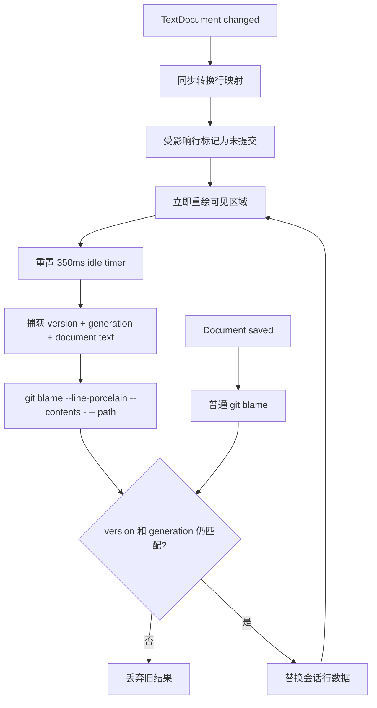

# Versioned Blame Session Design

状态：Deferred（1.0.0 继续使用编辑时同步重锚、保存后刷新 Blame 的现有实现）

## 背景

VS Code 公共 API 不支持带任意文本的独立 gutter。Git4VSC 当前使用锚定在行首的 `before` decoration 模拟 Blame 列，并在保存后重新执行 `git blame`。1.0.0 已在行首编辑、换行和合并行时同步重锚，解决光标和 Blame 标签短暂错位；但未保存内容的归属仍是本地行映射推算，异步请求、超大文件和连续编辑还有进一步优化空间。

后续目标是在不替换原生编辑器的前提下实现：

- 编辑期间 Blame 列始终稳定，不影响光标、缩进或换行。
- 未保存内容也能得到与当前缓冲区一致的 Blame 结果。
- 旧异步结果不能覆盖更新版本的文档。
- 大文件只创建当前视口附近的 decorations。
- 不在每次按键时执行 Git。

不考虑自定义 Webview 编辑器。它会破坏原生语言服务、编辑器命令和其他扩展兼容性，也不能作为普通文本编辑器的透明增强。

## 会话模型

每个启用 Blame 的文档建立一个 `BlameSession`，以文档 URI 为键：

```ts
interface BlameSession {
  uri: string;
  repositoryRoot: string;
  relativePath: string;
  documentVersion: number;
  requestGeneration: number;
  lines: GitBlameLine[];
  visibleRanges: readonly vscode.Range[];
  refreshTimer?: NodeJS.Timeout;
  disposed: boolean;
}
```

- `documentVersion` 对应发起计算时的 `TextDocument.version`。
- `requestGeneration` 每次计划新计算时递增，用于淘汰已在运行的旧请求。
- `lines` 保存完整的行归属；DecorationOptions 只为可见区域生成。
- 文档关闭、关闭 Blame 或扩展释放时销毁 timer 和 session。

## 更新流程



### 即时路径

`onDidChangeTextDocument` 不调用 Git，只完成可预测的同步工作：

1. 根据 `contentChanges` 转换原有行号。
2. 新增、合并或修改的行标记为未提交，保持固定 Blame 列宽。
3. 立即重建当前可见范围的行首装饰。
4. 记录新的文档版本并延后权威计算。

这条路径需要保持轻量，目标是不超过一个编辑器帧；普通输入不能遍历或重绘整个大文件。

### 空闲权威计算

停止编辑约 350ms 后，对当前内存内容执行：

```text
git -C <root> blame --line-porcelain --contents - -- <relative-path>
```

文档内容通过 command runner 的 stdin 传入。现有 runner 已支持 `input`，现有 `parseBlame` 可以继续解析输出；GitClient 增加独立的 `blameContents(location, path, contents)` 即可，避免让普通磁盘 Blame 的调用语义变得含糊。

请求完成时必须同时满足：

- session 仍存在且启用；
- `document.version === capturedVersion`；
- `session.requestGeneration === capturedGeneration`。

任一条件不满足就直接丢弃结果。第一阶段只需逻辑淘汰旧结果；如果连续大文件计算仍造成进程压力，再为 command runner 增加 `AbortSignal` 主动终止旧 Git 进程。

### 保存路径

保存后使用普通 `git blame --line-porcelain -- path` 读取磁盘事实，并走同一版本校验和渲染入口。未跟踪文件或没有可归属历史的文件统一生成未提交行，不弹错误通知。

## 可见区域渲染

监听 `onDidChangeTextEditorVisibleRanges`，合并所有可见区并在上下各增加约 80 行 overscan。只有该范围生成 `DecorationOptions`，滚动后再替换 decorations。

约束：

- `lines` 全量保存在 session 中，滚动不重新调用 Git。
- overscan 用于避免快速滚动时标签短暂空白。
- 同一文档出现在拆分编辑器中时，按 editor 分别计算可见范围并设置 decorations。
- 标签仍锚定在第 0 列；VS Code 没有真正的文本 gutter，因此折行和第三方 decoration 的极端组合仍属于平台边界。

## 模块改动

| 模块 | 计划改动 |
| --- | --- |
| `git-core/GitClient` | 新增 `blameContents`，通过 stdin 调用 `--contents -` |
| `BlameAnnotations` | 拆成 session 生命周期、编辑事件和 editor 投影协调器 |
| `BlameSession` | 管理文档版本、generation、debounce、行缓存和刷新状态 |
| `blame-lines` | 保留纯函数行映射，覆盖批量编辑和多光标场景 |
| Decoration renderer | 只接收行数据与可见范围，不负责 Git 或 session 状态 |

## 实施顺序

1. 引入 `BlameSession` 和 generation 校验，但继续使用保存后磁盘 Blame。
2. 增加 `GitClient.blameContents`、真实 Git 集成测试和空闲刷新。
3. 将 decoration 构建限制到 visible ranges + overscan。
4. 增加大文件基准和 VS Code Extension Host 交互测试，再决定是否支持进程取消。

每一步都应可以单独发布和回滚，不把 Git 请求、行映射与 UI 渲染一次性重写。

## 验收标准

- 行首插入/删除、Enter、Backspace 合并行、撤销、格式化和多光标编辑不移动代码或光标。
- 未保存内容空闲刷新后，未改行保持正确归属，修改行显示为未提交。
- 连续编辑时，旧 Blame 结果永远不会覆盖较新文档。
- 10,000 行文件连续输入时不为全部行重复创建 decorations，滚动不触发 Git。
- 保存、关闭再打开、拆分编辑器、切换仓库和 Worktree 后没有残留 session。
- 点击 Blame 仍能定位到 Commit Log 中对应提交；未提交行不可点击。

## 测试范围

- 纯函数：插入/删除/合并行、CRLF、批量粘贴、多光标和撤销后的行映射。
- Git 集成：磁盘内容与 `--contents -` 内容不同、重命名文件、未跟踪文件和 Worktree。
- 会话：generation 淘汰、文档关闭、开关 Blame、保存期间再次编辑。
- VS Code：光标位置、可见范围滚动、拆分编辑器和 decoration 数量。

