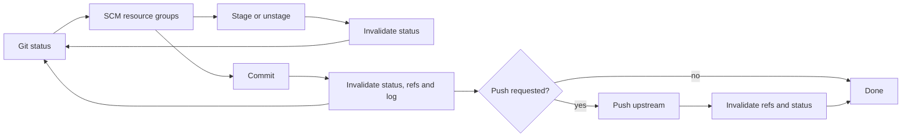

# VS Code Commit Workflow Design

## 1. Decision

Git4VSC will use VS Code's native Source Control view as the commit workspace. We will not build a second checkbox-based commit Webview.

The JetBrains screenshot combines two layers:

- IntelliJ Platform VCS owns the commit tool window, inclusion model, changes tree, diff navigation, toolbar and executor UI.
- Git4Idea supplies Git index semantics, Git-specific actions, commit execution and Commit and Push.

VS Code already owns the corresponding shell through `SourceControl`, resource groups, input box, action menus, native diff and Merge Editor. Git4VSC should provide richer Git behavior through that shell. In particular, **staged files are the commit inclusion set**. A second set of checkboxes would create two conflicting sources of truth.

The Git Log stays a separate bottom panel for repository history. It may navigate to committed-file diffs, but it does not become the working-tree commit editor.

## 2. JetBrains Source Map

| JetBrains source | Responsibility | Git4VSC counterpart |
| --- | --- | --- |
| `platform/vcs-impl/src/com/intellij/vcs/commit/ChangesViewCommitPanel.kt` | Connects the Changes view selection/inclusion model to the non-modal commit workflow | `apps/vscode-extension/src/scm-adapter.ts`; staged resource group is the inclusion model |
| `platform/vcs-impl/src/com/intellij/vcs/commit/NonModalCommitPanel.kt` | Composes changes, message, author, progress, options and commit actions | VS Code Source Control view + `SourceControl.inputBox` + commands contributed by `apps/vscode-extension/package.json` |
| `platform/vcs-impl/src/com/intellij/vcs/commit/CommitActionsPanel.kt` | Primary Commit action, executor dropdown, keyboard execution and options | `SourceControl.acceptInputCommand`, SCM title/source-control menus and command palette |
| `platform/vcs-impl/shared/src/com/intellij/openapi/vcs/changes/CommitChangesViewWithToolbarPanel.kt` | Refreshable changes tree, inclusion checkboxes, diff preview and source navigation | `ScmAdapter.sync()`, resource commands, `vscode.diff`, `vscode.open` |
| `platform/vcs-impl/resources/META-INF/VcsActions.xml` | Changes tree toolbar and context-menu composition | `contributes.menus` in `apps/vscode-extension/package.json` |
| `plugins/git4idea/backend/src/index/ui/GitStageCommitPanel.kt` | Treats staged paths as commit inclusion; validates conflicts and empty commits | staged group in `scm-adapter.ts`; validation in commit command |
| `plugins/git4idea/backend/src/index/GitStageCommitWorkflow.kt` | Computes what is staged and executes a staging-aware commit | `RepositoryController.commit()` and future commit options in `packages/repo-state` |
| `plugins/git4idea/backend/src/checkin/GitCommitAndPushExecutor.kt` | Commit executor that requests push after successful commit | future `git4vsc.commitAndPush` orchestration command |
| `plugins/git4idea/backend/src/checkin/GitCheckinEnvironment.kt` | Git commit arguments, per-root execution, refresh and push handoff | `packages/git-core/src/git-client.ts` + `packages/repo-state/src/repository-controller.ts` |
| `plugins/git4idea/backend/resources/intellij.vcs.git.backend.xml` | Stage/reset/revert/conflict/diff/stash Git actions | SCM resource and group context menus |

This is a behavioral reimplementation. No JetBrains UI assets or code are copied.

## 3. Current State

Already implemented:

- One native `SourceControl` per repository, so repositories remain independently operable.
- `Staged Changes`, `Changes` and `Untracked Files` groups.
- Git porcelain-v2 parsing, including rename/copy and conflict flags.
- Native working-tree and index diff resources.
- Stage, unstage, Commit Staged and Commit All.
- Commit success invalidates and refreshes repository status, refs and log.
- Log panel shows committed-file changes and opens commit-to-parent diffs on double click.

Important gaps:

- Conflicts are not presented as a dedicated group and have no Merge Editor commands.
- No discard, delete untracked, add to `.gitignore`, open file or copy-path actions.
- No group-level Stage All / Unstage All / Discard All commands.
- No Commit and Push, Amend or pre-commit validation flow.
- No line/hunk staging and no quick-diff provider.
- Progress and Git errors are still generic rather than operation-specific.

## 4. Target Interaction

### 4.1 Changes tree

The Source Control view uses these groups, in order:

1. `Merge Changes` — unresolved conflicts.
2. `Staged Changes` — the exact next-commit inclusion set.
3. `Changes` — tracked working-tree changes.
4. `Untracked Files` — files not yet added to Git.

Files use the existing Git status decoration. Renames display the destination path while retaining the original path for diff lookup.

Opening behavior:

- Activating a changed file opens the native diff for the correct pair: `HEAD ↔ index` for staged, `index ↔ working tree` for unstaged.
- Opening an untracked file opens the source because there is no useful left-hand revision.
- The editor's standard preview/pinned-editor behavior remains under VS Code control. Git4VSC does not emulate IntelliJ tabs inside a Webview.

### 4.2 Resource menus

| Context | Primary actions | Secondary actions |
| --- | --- | --- |
| Merge Changes | Open Merge Editor, Stage Resolved | Accept Current, Accept Incoming, Accept Both, Open File |
| Staged Changes | Unstage, Show Staged Diff | Open File, Copy Relative Path |
| Changes | Stage, Show Diff, Discard Changes | Open File, Add to `.gitignore`, Copy Relative Path |
| Untracked Files | Add to Git, Open File | Delete, Add to `.gitignore`, Copy Relative Path |

Rules:

- Destructive actions use VS Code's modal confirmation and show the exact affected file count.
- Multi-selection is supported by the same command; no one-file-only duplicate command set.
- `Add to .gitignore` edits the repository root `.gitignore` with a repository-relative path. It is only offered when the file is untracked or ignored behavior is meaningful.
- Conflict “accept” actions are convenience operations; the Merge Editor is the preferred path for non-trivial conflicts.

Group headers add Stage All, Unstage All and Refresh where relevant. Repository-level commands remain available from the Source Control title and command palette.

### 4.3 Commit area

The commit message remains in the native Source Control input box.

Primary action:

- `Commit` commits staged changes. It is disabled logically when the message is empty, the index is empty or unresolved conflicts exist, and reports a focused validation message.

Additional executors:

- `Commit and Push`
- `Commit All`
- `Commit All and Push`
- `Amend Commit…`

`Commit and Push` is one user workflow but two ordered Git operations:

1. Commit within the selected repository's existing write queue.
2. Refresh status and log immediately so the local commit is never hidden by a later push failure.
3. Push the current branch to its upstream.
4. If there is no upstream, ask for the remote/branch and publish with `--set-upstream`.
5. Refresh refs, ahead/behind and status after push.

A push failure does not roll back a successful local commit. The error should clearly say that the commit exists locally and provide Retry Push / View Log actions.

`Amend Commit…` is explicit rather than a persistent checkbox in the first implementation. Before execution it shows the current HEAD subject and whether staged changes will be included. The core command uses `git commit --amend` and preserves the same repository-local operation lock.

### 4.4 State and feedback

- Operations in one repository are serialized by `RepositoryController`; another repository remains enabled and can run concurrently.
- Source Control progress reports the repository name and current phase.
- Expected Git failures are classified into actionable cases: empty commit, hook failure, unresolved conflict, non-fast-forward, authentication and missing upstream.
- Refresh is invalidation-based. UI commands do not manually patch repository snapshots after writes.

## 5. Module Changes

### `packages/git-core`

Add small, command-shaped methods rather than a generic command builder exposed to UI:

- `discard(paths)`
- `deleteUntracked(paths)` (filesystem adapter may own deletion if Trash support is required)
- `checkoutConflictSide(paths, side)`
- `commit(message, { all, amend, noVerify, signoff })`
- `push({ remote, branch, setUpstream })`
- index/working-tree content readers needed by quick diff

### `packages/repo-state`

- Add corresponding repository operations and precise invalidation sets.
- Add a `commitAndPush` orchestration use case while keeping commit and push results distinguishable.
- Keep the existing per-repository write queue; do not introduce a global extension lock.

### `apps/vscode-extension/src/scm-adapter.ts`

- Split conflicts into `Merge Changes`.
- Assign stable `contextValue` values by group/state.
- Register the quick-diff provider.
- Map file activation to staged, working-tree or source opening behavior.
- Surface validation and operation state through native SCM affordances.

### `apps/vscode-extension/src/extension.ts`

- Keep command handlers thin: resolve repository/resources, ask for destructive confirmation, run the repository use case and display its typed result.
- Register stage-all, unstage-all, discard, ignore, open, copy-path, conflict and commit executor commands.

### `apps/vscode-extension/package.json`

- Contribute resource, resource-group and source-control menus using `when` clauses based on `scmProvider` and `resourceState` context.
- Keep frequent actions inline; put destructive and less common actions in menu groups.
- Avoid global keybindings that conflict with VS Code. Commit continues to use the Source Control input action.

## 6. Delivery Slices

### Slice A — native commit parity essentials

- Dedicated conflict group.
- Open, diff, copy path, stage/unstage all, discard and ignore actions.
- Commit validation.
- Commit and Push with missing-upstream handling.
- Unit tests for command routing and refresh invalidations; Extension Host menu/SCM smoke tests.

Acceptance: the common open → inspect → stage → commit → push loop can be completed without leaving the Source Control view, and all repositories remain independently usable.

### Slice B — precise changes

- Quick diff provider.
- Selected-line/hunk stage, unstage and discard commands using Git patches.
- Merge Editor entry and conflict-side actions.
- Geometry-independent parser tests for zero-context patches, renames and line-ending behavior.

Acceptance: users can construct a partial commit without staging an entire file and can complete a normal text conflict through native VS Code editors.

### Slice C — advanced commit options

- Amend, sign-off and skip-hooks options.
- Structured hook/GPG errors.
- Optional commit author override only if real usage justifies the UI.

JetBrains changelists, shelf and Local History are intentionally outside these slices: they are IntelliJ platform concepts, not Git primitives, and forcing them into the VS Code SCM model would make the extension feel less native.

## 7. Verification

- Git integration tests: staged/unstaged/untracked/conflicted groups, discard, ignore, amend, missing upstream and rejected push.
- Repository-state tests: exact invalidations after every success/failure and concurrent operations in different repositories.
- Extension Host tests: group ordering, context values, multi-selection command arguments and commit input behavior.
- Manual VS Code checks on Windows and macOS: native diff preview, Merge Editor, confirmation dialogs, theme/high-contrast rendering and keyboard focus.

